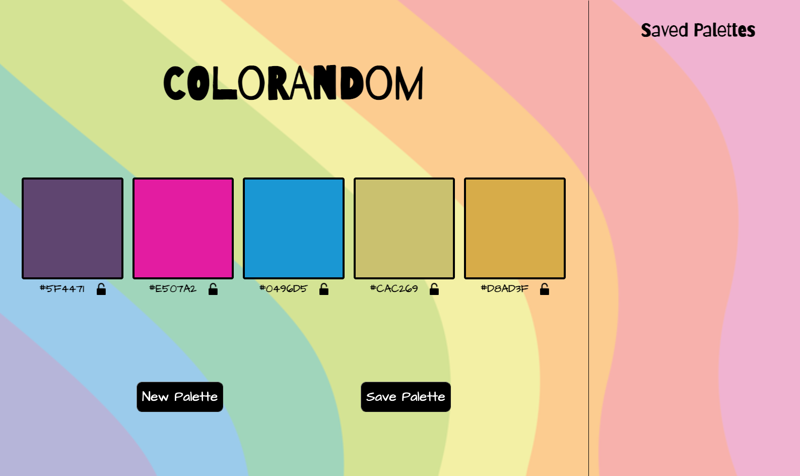
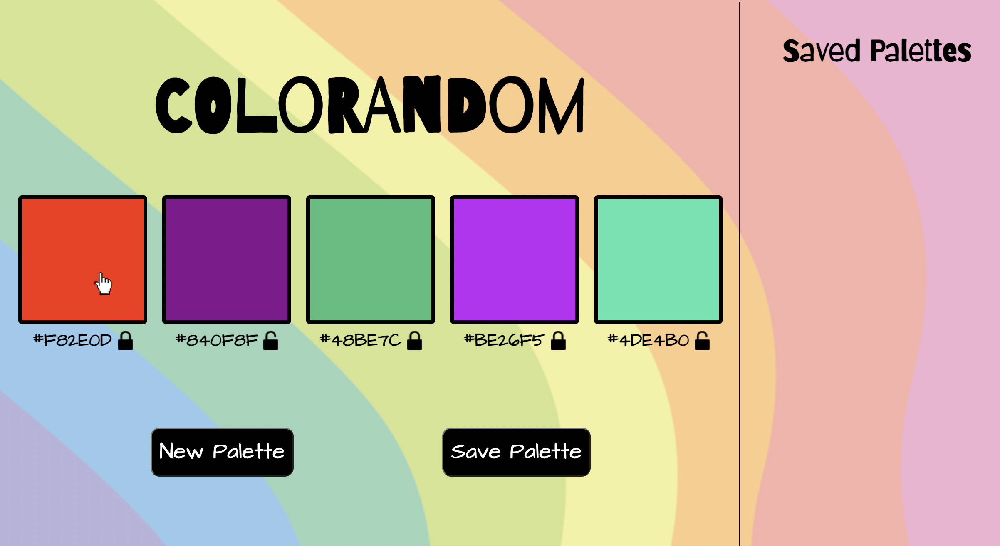
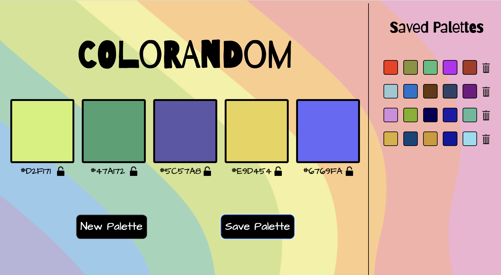

# **ColoRandom**

This web app allows users to display, customize and save random color palettes. ColoRandom was a learning assignment for the Front End Development program at Turing School of Software and Design. The following contributors had approximately 4 weeks experience using JavaScript, HTML and CSS.
  

# **Contributors**

[Jacob Lavarine](https://github.com/Jlavarine)

[Rachel Hill](https://github.com/rachellhill)

[Angele Williams](https://github.com/angelewilliams)

# **Technologies Used**

- JavaScript
- HTML
- CSS

# **Local Set up Instructions**
- Fork this repo to create your own copy.
- Clone your newly-forked repo. Make sure SSH is selected.
- Type cd ColoRandom to move into the root directory.
- Use a text editor of your choice to make changes to the file.
- See you changes in the browser by running open index.html in your terminal.
- The application is also accessible via this deploy link: [ColoRandom](https://jlavarine.github.io/ColoRandom/)

# **Instructions For Use**
- Upon the browser loading the user will see a random palette of colors displayed.
- The user can click the _“New Palette”_ button to generate a new palette.
 
 If they would like to keep 1 or more colors but change the rest, they can click the color box and 'lock' the color. The lock icon below the color box will change from unlocked to locked.

- Once a user is satisfied with the displayed palette, they can click _“Save Palette”_ and they will see a mini representation of their favorite colors displayed in the Saved Palette section on the right side of the page.
  

  

- If a user would like to remove a saved palette, they can click the trash can to the right of the miniature palette to remove it.

# **Code Architecture**

This project consists of 5 primary files - scripts.js, Palette.js, Color.js, index.html, styles.css and ancillary files containing images.

- Palette.js and Color.js are the two class files that interact with the data model.
- main.js houses our JavaScript functionality
